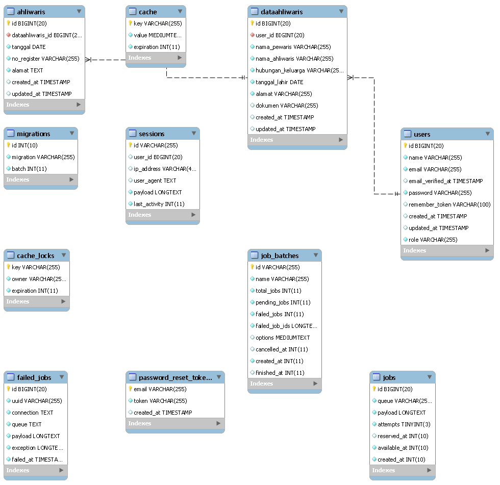
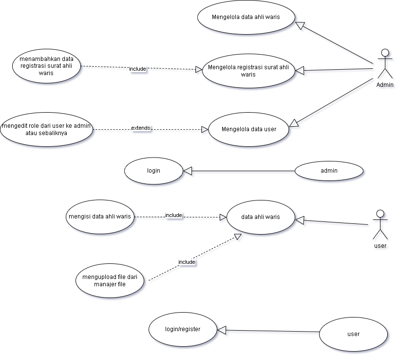

# Project Ukk Pendataan ahli waris 

## Konsep Web 
   Ini adalah web yang di buat menggunakan laravel 12, dengan tampilan offcanvas,dan warna yang soft, web ini digunakan untuk mengelola data. 

## Fitur yang ada 
  🔹 1. Manajemen Data Ahli Waris (user)

     Tambah, edit, hapus, 

      Data yang disimpan:

                Nama ahli waris

                Nama pewaris

                Hubungan keluarga

                Tanggal lahir

                Alamat

                Dokumen  (upload file)

   🔹 2. Registrasi Surat Ahli Waris (admin)

      Input data registrasi:

                Nama pewaris

                Nama ahliwaris

                Tanggal

                Nomor register

                Alamat

    🔹 3. Admin dapat:

               Melihat daftar user

               Mengubah role user melalui halaman edit user

               Admin dapat

   🔹 4. Upload File

               Mendukung upload dokumen (docx, pdf, dll)
               
   🔹 5. Navigasi 

               Navbar dengan route:

               Dashboard (Admin)

               Data Ahli Waris (User)

               Registrasi Surat (Admin)

               Manajemen User (Admin)

## Akun Default untuk User dan Admin
      Admin : - email    : admin@example.com
              - password : admin1234

      User  : - email    : user@example.com
              - password : user1234

## ERD dan relasi antar table
   
   

## UML 
   

## syarat lingkungan
  -PHP 8.2.12 & Web Server (Apache, Lighttpd, atau Nginx)
  -Database (MySQL)
  -Web Browser (Chrome,Edge,dll)

## cara instalasi
   1. Klona repositori
      jalankan :
      git clone https://github.com/Tsabitah-dj/projectukk.git
      cd projectukk
      composer install
      cp .env.example  
      ren .env

   3. konfigurasi database
      DB_CONNECTION=mysql
      DB_HOST=127.0.0.1
      DB_PORT=3306
      DB_DATABASE=ahliwaris_db
      DB_USERNAME=root
      DB_PASSWORD=

   4. jalankan migrasi,db seed, dan key generate
      php artisan migrate
      php artisan key:generate
      php artisan db:seed
      php artisan storage:link

   6. Jalankan situs web 
 artisan migrate
      php artisan key:generate
      php artisan db:seed

   4. Jalankan situs web 
      php artisan serve

## Dibuat oleh
   https://github.com/Tsabitah-dj

